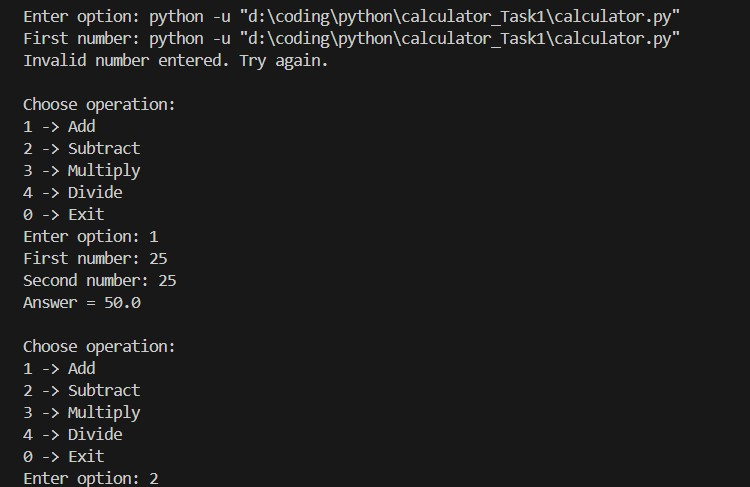
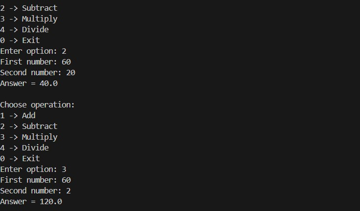
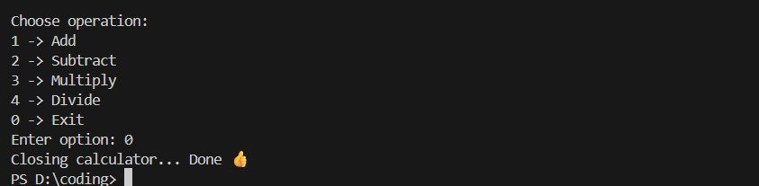

##Calculator CLI App
This task is a basic command-line calculator developed using Python as part of my Python Developer Internship task. 
It performs simple arithmetic operations like addition, subtraction, multiplication, and division while helping me understand Python functions, loops, and user input handling.

## Features
- Addition
- Subtraction
- Multiplication
- Division
- Continuous loop until exit

## Tools Used
- Python
- VS Code

## How to Run
 calculator.py

## Output Screenshot
## Output Screenshot

